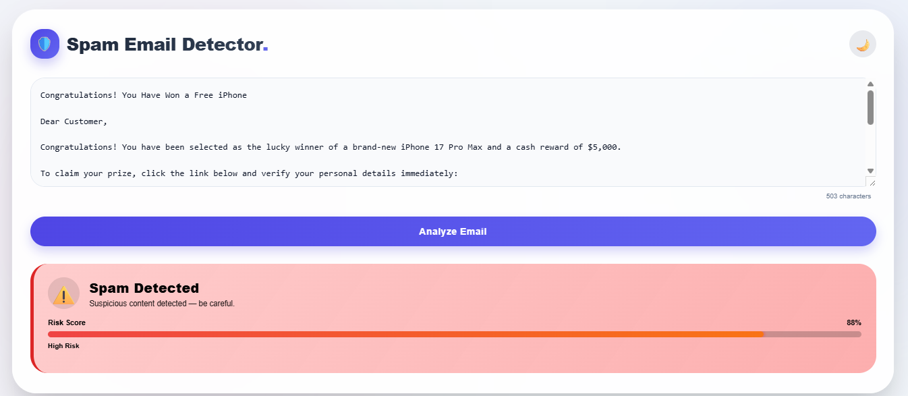
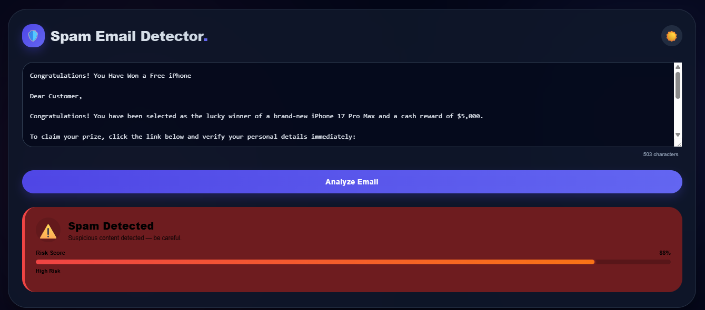

# 🌐 Spam Email Detection Frontend

A **modern and responsive frontend application** built using React that allows users to check whether an email is **Spam or Not Spam** by interacting with a Machine Learning backend API.

This UI provides a clean and user-friendly interface for real-time spam detection.

---

## 🚀 Features

🎯 **Interactive User Interface**

* Simple input box to enter email text

⚡ **Real-Time Prediction**

* Instantly communicates with backend API

🔗 **API Integration**

* Seamlessly connects with Flask backend

📱 **Responsive Design**

* Works smoothly on desktop, tablet, and mobile

🎨 **Clean UI/UX**

* Minimal and modern design for better user experience

---

## 🏗️ Tech Stack

| Category       | Technology Used  |
| -------------- | ---------------- |
| **Frontend**   | React (Vite)     |
| **Language**   | JavaScript       |
| **Styling**    | CSS              |
| **API Calls**  | Axios            |
| **Deployment** | Vercel           |

---

## 📡 API Integration

### 🔹 Backend Endpoint

```id="7kz9pl"
POST /predict
```

### 📥 Request Sent

```json id="k92xqp"
{
  "email": "Sample email text entered by user"
}
```

### 📤 Response Received

```json id="d82mka"
{
  "prediction": "Spam" or "Not Spam"
}
```

---

## 🧠 How It Works

1. 🧑‍💻 **User Input**
   User enters email content in the input field

2. 📡 **API Call**
   Frontend sends request to backend API

3. 🔄 **Processing**
   Backend processes the text using ML model

4. 📊 **Prediction Display**
   Result (Spam / Not Spam) is shown on UI

---

## 💡 Example Workflow

```id="x1pzql"
User Input → React UI → API Request → Backend → ML Model → Response → UI Display
```

---


## 🌐 Live Demo

<p align="center">
  <a href="https://spam-email-detection-frontend.vercel.app">
    
  </a>
</p>


-------

# 📧 Spam Email Detection Backend

A **Machine Learning–powered backend API** that detects whether an email is **Spam or Not Spam** using NLP techniques and a trained classification model.

Easily integrate with **React, mobile apps, or any frontend** to build a complete spam detection system.

---

## 🚀 Features

✨ **Smart Spam Detection**
Detects spam emails using a trained ML model

⚡ **Fast API Response**
Built with Flask for quick and efficient processing

📡 **REST API Ready**
Easily connect with any frontend (React, Android, etc.)

🧠 **NLP-Based Processing**
Text cleaning, tokenization, and vectorization

🛠 **Lightweight & Deployable**
Simple setup and supports deployment on Render

---

## 🏗️ Tech Stack

| Category       | Technology Used        |
| -------------- | ---------------------- |
| **Backend**    | Flask                  |
| **Language**   | Python                 |
| **ML Library** | Scikit-learn           |
| **NLP**        | NLTK / Text Processing |
| **Deployment** | Render                 |

---

## 📡 API Endpoint

### 🔹 Predict Spam Email

**Endpoint:**
POST /predict

### 📥 Request Body (JSON)

```json
{
  "email": "Congratulations! You have won a free lottery. Click now!"
}
```

### 📤 Response

```json
{
  "prediction": "Spam"
}
```

---

## 🧠 How It Works

1. 📩 **Input Received**
   Email text is sent via API request

2. 🧹 **Text Preprocessing**
   Cleaning, removing stopwords, tokenization

3. 🔢 **Feature Extraction**
   TF-IDF vectorizer converts text → numerical format

4. 🤖 **Prediction**
   ML model classifies email as:


# 🌐 Render Deployment

🚀 [View Live App](https://spam-email-backend-49b8.onrender.com)
  

-------

# 📊 Dataset Summary

## Overview

This dataset is used for **Email Spam Detection**, a binary text classification problem where the goal is to determine whether an email is **Spam** or **Not Spam (Ham)** based on its content.

## Dataset Information

* **Total Records:** 5,728 emails
* **Total Features:** 2
* **Dataset Type:** Text Classification
* **Target Variable:** Spam

## Features Description

| Feature | Data Type       | Description                                                          |
| ------- | --------------- | -------------------------------------------------------------------- |
| Text    | Object (String) | Contains the complete email content including subject and body text. |
| Spam    | Integer         | Target variable indicating whether the email is spam or not.         |

## Target Variable Distribution

| Class        | Count |
| ------------ | ----- |
| Not Spam (0) | 4,360 |
| Spam (1)     | 1,368 |


--------

# 💻 Project Output

<p align="center">
  
  
</p>

<p align="center">
  Light Mode Prediction &nbsp;&nbsp;&nbsp;&nbsp; Dark Mode Prediction
</p>


